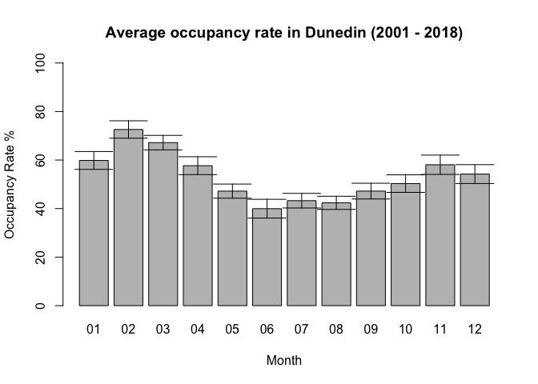
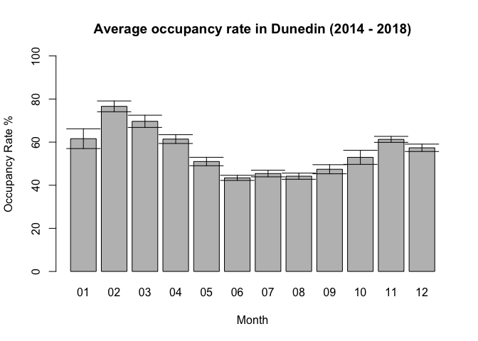

This is a quick tutorial to download and begin to analyse New Zealand tourism data.  In this example we are going to look at the occupancy rate of accomidations in Dunedin. We'll first begin by downloading the data.  Stats NZ Infoshare is a great tool to begin with.  [InfoShare](http://archive.stats.govt.nz/infoshare/Default.aspx). From there we go to Tourism->Accommodation Survey - ACS->Territorial authority by variable (Monthly).  In the next page you can select what individual data you'd like.  In this example, I choose data for Dunedin City, in Territorial Authority and select all data for each of the other boxes.  Then I export as .csv file.

First let's load dplyr, an incredibly useful tool for data manipulation

```r
library(dplyr)
```

```
## 
## Attaching package: 'dplyr'
```

```
## The following objects are masked from 'package:stats':
## 
##     filter, lag
```

```
## The following objects are masked from 'package:base':
## 
##     intersect, setdiff, setequal, union
```
The next step we load the the datafile and do a bit of data manipuation to adjust the names of the columns and to discard the some rows we don't need.

```r
datafile = 'ACS475801_20190302_015859_74.csv'
tourism <- read.csv(datafile, skip = 3, header = T)
tourism <- head(tourism,-21)
colnames(tourism)<- c("Date" , "Number_of_establishments","Capacity_daily", "Capacity_monthly", "Occupancy_monthly", "Guest_Arrivals", "Guest_Nights")
```
We can calculate the occupancy rate by the divividing the monthly occupancy by the monthy capacity.

```r
tourism$Occupancy_rate <- tourism$Occupancy_monthly / tourism$Capacity_monthly
```
Next we do a bit of manipulation to make the dates more accessible.

```r
tourism$Date_formated <- as.Date(paste(tourism$Date, "15"),format='%YM%m %d')
tourism$Date_month <- format(tourism$Date_formated, "%m")
tourism$Date_year <- format(tourism$Date_formated, "%Y")
```

Let's plot occupancy rate by month in a bar chart.

```r
monthly_tourism <- tourism %>%
  group_by(Date_month) %>%
  summarize(mean_occ = mean(Occupancy_rate)*100, std_occ = sd(Occupancy_rate)*100)

barCenters <- barplot(height = monthly_tourism$mean_occ,
                      main = "Average occupancy rate in Dunedin (2001 - 2018)", xlab = "Month", ylab = "Occupancy Rate %", ylim=c(0,100), names.arg = monthly_tourism$Date_month)
arrows(barCenters, monthly_tourism$mean_occ-monthly_tourism$std_occ,
       barCenters, monthly_tourism$mean_occ+monthly_tourism$std_occ,angle=90,code=3)
```

<!-- -->

Now lets try that for the most recent 5 years. Here all I have changed in the filter within the dpylr block

```r
monthly_tourism_2014 <- tourism %>%
  filter(Date_year > 2013) %>% # select dates after 2013
  group_by(Date_month) %>%
  summarize(mean_occ = mean(Occupancy_rate)*100, std_occ = sd(Occupancy_rate)*100)

barCenters <- barplot(height = monthly_tourism_2014$mean_occ,
                      main = "Average occupancy rate in Dunedin (2014 - 2018)", xlab = "Month", ylab = "Occupancy Rate %", ylim=c(0,100), names.arg = monthly_tourism_2014$Date_month)
arrows(barCenters, monthly_tourism_2014$mean_occ-monthly_tourism_2014$std_occ,
       barCenters, monthly_tourism_2014$mean_occ+monthly_tourism_2014$std_occ,angle=90,code=3)
```

<!-- -->
